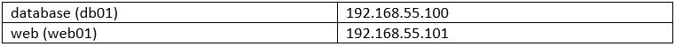
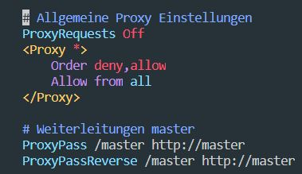

# M300_dlennstroem

Doku der LB2 von David Lennström.
In dieser LB werde ich  mithilfe von Vagrant einen Webserver automatisieren.

## 1. K1

Folgende Software habe ich installiert, damit alles so läuft wie es sollte:
 - VirtualBox für das Virtualisieren
 - Vagrant damit VMs automatisiert aufgesetzt werden können.
 - VS-Code (Bereits installiert) -> Vagrant Extension wurde auch noch   
   installiert.
 - Git-Client für die Versionskontrolle
 - SSH-Key für den Client hinterlegt
 
 ## 2. K2
 ### 2.1. GIT-Client
Damit das Repo immer up to date bleibt, wurde GIT installiert. GIT kann über die CLI mit GIT-Bash bedient werden. Die Syntax ist hierbei die gleiche wie Bash. Damit man die REPO lokal haben kann, wird diese mit dem Befehl *git clone* auf den Client geladen. Änderungen im Repo können mit *git pull* heruntergeladen werden. 
 
 Um Änderungen hochzuladen muss man folgende 3 Befehle absetzen: 
1.	*git add -A*
2.	*git commit  ‘’Nachricht’’*
3.	*git push*

**Achtung:** Commit und Pull-Request können nur in dem Parent-Directory ausgeführt werden!

### 2.2. Vagrant
Wie bereits erwähnt, lässt sich mit Vagrant eine VM Umgebung sehr einfach automatisiert aufsetzen. Vagrant-VMs werden mithilfe eines Vagrantfiles aufgesetzt. In diesem File ist die ganze Konfiguration reingeschrieben. Mit einem Vagrant-File lassen sich gleich mehrere VMs aufsetzen. Vagrant funktioniert sehr gut mit VirtualBox zusammen.

## 3. K3
### 3.1. VM aus Vagrnt-Cloud
 Eine VM aus der Vagrant-Cloud einrichten ist sehr einfach, es wird dafür nur ein Befehl benötigt. 
 
### 3.2. Vagrant-Befehle
 Wichtige Befehle von Vagrant:
  -*vagrant init* -> erstellt automatisch eine VM und ein Vagrantfile
  -*vagrant up* -> installiert die VM gemäss Vagrantfile
  -*vagrant status* -> Statusanzeige
  -*vagrant destroy* -> VM löschen.
  -*vagrant ssh* -> Mit SSH auf die VM zugreifen.
  -*vagrant halt* -> VM pausieren
 
 
### 3.3.  Vagrant-File
Wir haben in das Vagrant fille auch gleich alle Befehle für die Firewall reingeschrieben, damit wir diese später nicht noch absetzen müssen.

```
# -*- mode: ruby -*-
# vi: set ft=ruby :

VAGRANTFILE_API_VERSION = "2"

Vagrant.configure(VAGRANTFILE_API_VERSION) do |config|
	#database
	config.vm.define "database" do |db|
		db.vm.box = "ubuntu/xenial64"
		db.vm.provider "virtualbox" do |vb|
			vb.memory = "512"
		db.vm.hostname = "db01"
		db.vm.network "private_network", ip: "192.168.55.100"
		db.vm.synced_folder "./db", "/home/vagrant/db"
		db.vm.provision "shell", inline: <<-SHELL
			#install mysql server
			sudo debconf-set-selections <<< 'mysql-server mysql-server/root_password password root'
			sudo debconf-set-selections <<< 'mysql-server mysql-server/root_password_again password root'
			sudo apt-get -y install mysql-server

			#install ssh service
			sudo apt-get install openssh-server
			sudo service ssh start

			#create db directory for filesync
			sudo mkdir db

			#install ufw
			sudo apt-get install ufw -y
			sudo ufw -f enable

			#create rules
			sudo ufw allow from any to any port 3306
			sudo ufw allow from any to any port 22


			SHELL
	end

end
	#webserver
	config.vm.define "web" do |web|
    web.vm.box = "ubuntu/xenial64"
    web.vm.hostname = "web01"
    web.vm.network "private_network", ip:"192.168.55.101"
		web.vm.network "forwarded_port", guest:80, host:8080, auto_correct: true
		web.vm.synced_folder "./www", "/var/www/html"
		web.vm.provision "shell", inline: <<-SHELL
			#install apache service
			sudo apt-get update
			sudo apt-get -y install apache2

			#install ufw
			sudo apt-get install ufw -y
			sudo ufw -f enable

			#create rules
			sudo ufw allow 80/tcp
			sudo ufw allow from any to any port 22

		SHELL
		web.vm.provider "virtualbox" do |vb|
	  	vb.memory = "512"
		end
	end

 end

```

  
### 3.4. Umgebung
  Meine Umgebung besteht aus einer MySQL-VM und einem Apache-Webserver. 

Die Default-Policy der Firewall ist deny all. Folgende Regeln wurden erstellt, damit die Dienste ordnungsgemäss funktionieren: 

**db01**


**web01**


### 3.5. Netzplan
    +---------------------------------------------------------------+
    ! Notebook - Schulnetz 10.x.x.x und Privates Netz 192.168.55.1  !                 
    ! Port: 8080 (192.158.55.101:80)                                !	
    !                                                               !	
    !    +--------------------+          +---------------------+    !
    !    ! Web Server         !          ! Datenbank Server    !    !       
    !    ! Host: web01        !          ! Host: db01          !    !
    !    ! IP: 192.168.55.101 ! <------> ! IP: 192.168.55.100  !    !
    !    ! Port: 80           !          ! Port 3306           !    !
    !    ! Nat: 8080          !          ! Nat: -              !    !
    !    +--------------------+          +---------------------+    !
    !                                                               !	
    +---------------------------------------------------------------+
	

## 4. K4
### 4.1. Firewall
Die Firewall haben wir, wie bereits erwähnt, bereits im Vagrantfile eingerichtet. Hier noch die wichtigsten befehle:

  -*vagrant init* -> erstellt automatisch eine VM und ein Vagrantfile
  -*ufw -f enable/disable* -> Firewall enablen/disablen. -f = force (Per Standard ist sie disabled.)
  -*ufw status* -> Statusanzeige mit allen Regeln
  -*ufw allow* -> Einen Port öffnen.
  -*ufw deny* -> Port schliessen.
  
### 4.2. Reverse Proxy
Ich hatte für den Reverse-Proxy fast keine Zeit mehr. 
Das Packet *sudo apt-get install libapache2-mod-proxy-html* liess sich nicht installieren. 
Das Packet *sudo apt-get install libxml2-dev* aber schon.

Danach habe ich die entsprechenden Apache-Module aktiviert:
     -*a2enmod proxy*
     -*a2enmod proxy_html*
     -*a2enmod proxy_http*
     
Danach habe ich mit *sudo service apache2 restart* den Dienst neu gestartet.

**Config-File**
 */etc/apache2/sites-enabled/001-001-reverseproxy.conf*
 

 
 Ich hatte keine Zeit mehr, um EInstellungen vorzunehmen, desshalb habe ich es mal beim default gelassen.

## Reflexion

Als Alan und ich mit der LB2 begonnen haben, sind wir recht motiviert an die Sache gegangen. Wir haben die Umgebung eingerichtet und alles installiert. Dann war ich aber einen Tag krank und wir sind ein wenig  in den Verzug geraten. Zuerst haben wir versucht eine Firewall automatisiert einzurichten. Dies hat aber nicht wirklich geklappt. Deshalb haben wir uns in der Mitte der LB einem einfacherem Projekt gewidmet. Schlussendlich haben wir ein Apache-Webserver und eine MySQL-DB aufgesetzt. Zum Schluss hatten wir fast keine Zeit mehr zum dokumentieren. Rückblickend muss ich sagen, dass wir uns von Beginn an ein besseres Bild über die LB hätten machen sollen, dann wären Dinge vielleicht ein wenig einfacher gelaufen.   


