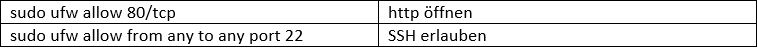

# M300_dlennstroem

Doku der LB2 von David Lennström.
In dieser LB werde ich  mithilfe von Vagrant einen Webserver automatisieren.

## 1. K1

Folgende Software habe ich installiert, damit alles so läuft wie es sollte:
 - VirtualBox für das Virtualisieren
 - Vagrant damit VMs automatisiert aufgesetzt werden können.
 - VS-Code (Bereits installiert) -> Vagrant Extension wurde auch noch   
   installiert.
 - Git-Client für die Versionskontrolle
 - SSH-Key für den Client hinterlegt
 
 ## 2. K2
 ### 2.1. GIT-Client
Damit das Repo immer up to date bleibt, wurde GIT installiert. GIT kann über die CLI mit GIT-Bash bedient werden. Die Syntax ist hierbei die gleiche wie Bash. Damit man die REPO lokal haben kann, wird diese mit dem Befehl *git clone* auf den Client geladen. Änderungen im Repo können mit *git pull* heruntergeladen werden. 
 
 Um Änderungen hochzuladen muss man folgende 3 Befehle absetzen: 
1.	*git add -A*
2.	*git commit  ‘’Nachricht’’*
3.	*git push*

**Achtung:** Commit und Pull-Request können nur in dem Parent-Directory ausgeführt werden!

 ### 2.2. Vagrant
Wie bereits erwähnt, lässt sich mit Vagrant eine VM Umgebung sehr einfach automatisiert aufsetzen. Vagrant-VMs werden mithilfe eines Vagrantfiles aufgesetzt. In diesem File ist die ganze Konfiguration reingeschrieben. Mit einem Vagrant-File lassen sich gleich mehrere VMs aufsetzen. Vagrant funktioniert sehr gut mit VirtualBox zusammen.

 ## 3. K3
 ### 3.1. VM aus Vagrnt-Cloud
 Eine VM aus der Vagrant-Cloud einrichten ist sehr einfach, es wird dafür nur ein Befehl benötigt. 
 
 ### 3.2. Vagrant-Befehle
 Wichtige Befehle von Vagrant:
  -*vagrant init* -> erstellt automatisch eine VM und ein Vagrantfile
  -*vagrant up* -> installiert die VM gemäss Vagrantfile
  -*vagrant status* -> Statusanzeige
  -*vagrant destroy* -> VM löschen.
  -*vagrant ssh* -> Mit SSH auf die VM zugreifen.
  -*vagrant halt* -> VM pausieren
  
  ### 3.3. Umgebung
  Meine Umgebung besteht aus einer MySQL-VM und einem Apache-Webserver. 

Die Default-Policy der Firewall ist deny all. Folgende Regeln wurden erstellt, damit die Dienste ordnungsgemäss funktionieren: 

**db01**

**web01**

## Reflexion

Als Alan und ich mit der LB2 begonnen haben, sind wir recht motiviert an die Sache gegangen. Wir haben die Umgebung eingerichtet und alles installiert. Dann war ich aber einen Tag krank und wir sind ein wenig  in den Verzug geraten. Zuerst haben wir versucht eine Firewall automatisiert einzurichten. Dies hat aber nicht wirklich geklappt. Deshalb haben wir uns in der Mitte der LB einem einfacherem Projekt gewidmet. Schlussendlich haben wir ein Apache-Webserver und eine MySQL-DB aufgesetzt. Zum Schluss hatten wir fast keine Zeit mehr zum dokumentieren. Rückblickend muss ich sagen, dass wir uns von Beginn an ein besseres Bild über die LB hätten machen sollen, dann wären Dinge vielleicht ein wenig einfacher gelaufen.   

